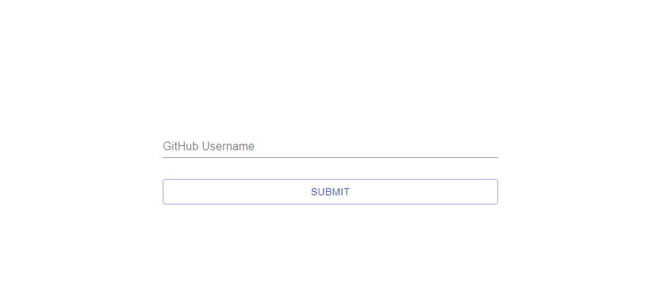

# Monica & Tom LAP 3 Code Challenge

## Repo Getter

This website allow you to check the public repositories of any GitHub user.

[Live site](https://repo-getter.netlify.app/)

## Installation & Usage

### Installation

- Clone repository
- cd into repository folder
- Run `npm install` and wait for installation

### Usage

- Run `npm run dev` and navigate to [local server](http://localhost:8080/)
- Input your GitHub username and press submit
- View your repositories and click on one to see further info/navigate to github repo

## Technologies

  
<b>Client Code</b>

  
  - [React](https://www.npmjs.com/package/react)
  - [React-router](https://www.npmjs.com/package/react-router)
  - [GitHub API](https://docs.github.com/en/rest)

  
<b>Styling</b>

- [Material-UI](https://material-ui.com/)
- [Material-UI Icons](https://material-ui.com/components/icons/#material-icons)

## Changelog

Find the full changelog [here](changelog.md)

## Future Features

- include further repo info such as commits or fork numbers
- get more than 80% coverage in tests 

## Licence

[MIT Licence](https://opensource.org/licenses/mit-license.php)
