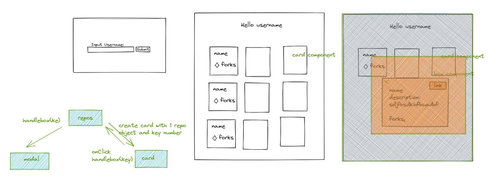

# Changelog

## Planing 
 - sketch in excalidraw
  
 - centraliced model with branches in github
  
## Aplication
- stub file structure
- add initial dependencies
  - react
  - react router
  - redux (never used)
  - material ui
- create routing for two main pages
- add functionality of repos page
- add material ui form in home
- add RepoCard component
- merge material
- implement repocard in repos page
- add RepoModel component
- implement repomodel in repos page
- add styling to repos page
- add error handling form
- add search bar
- add icon ui package
- add back button to repos
- remove unused packages
- add unit test for repocard and repoModel

## Misc 
- deployed on netlify
- update Readme and Changelog
